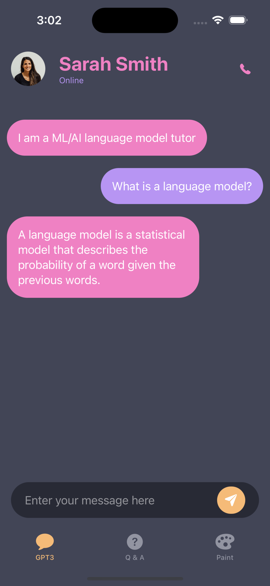
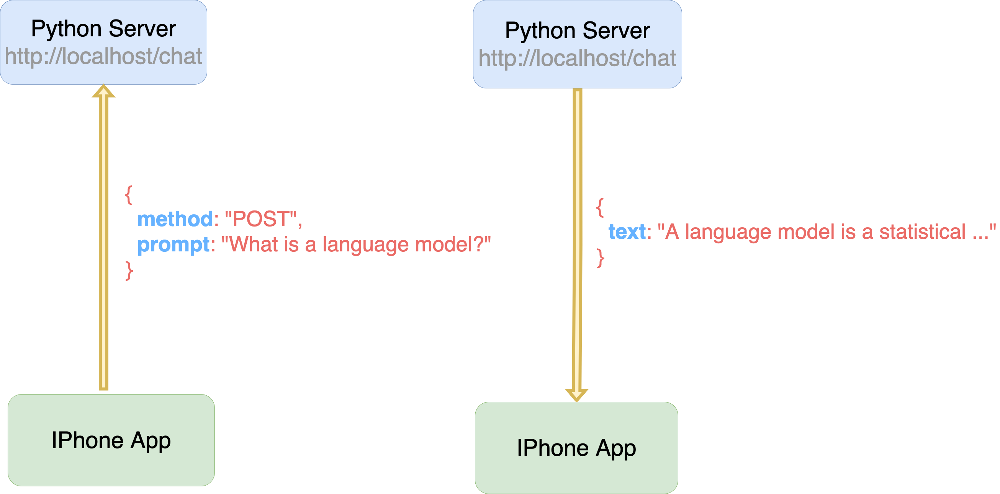
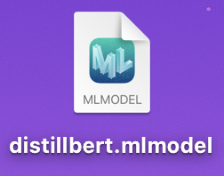

Integrating Transformers into IOS Applications
================
Qiushi Yan <br />
[qiushiyan/ios-transformers](https://github.com/qiushiyan/ios-transformers)

## Why developing models for mobile devices

- Develop mechanical sympathy and understand the real use cases

- Crowd-source training data, e.g. image recognition

## How to integrate transformers into mobile devices

Depending on where the model is:

- <span class="yellow">server-based</span>: model is located on an
  enterprise server

- <span class="yellow">client-based</span>: model is built into the
  user’s device

## Demo: server-based GPT3 chatbot

<div class="columns">

<div class="column" width="30%">



</div>

<div class="column" width="60%">



</div>

</div>

## Making API requests

<span class="yellow">Python API Server</span>

<div class="code-with-filename">

**server.py**

``` python
import openai
def reply(prompt: str):
     response = openai.Completion.create(
        model="text-davinci-002",
        prompt=prompt,
        temperature=0.3,
        max_tokens=60,
        top_p=1.0,
        frequency_penalty=0.5,
        presence_penalty=0.0,
        stop=["You:"],
    )
    return response["choices"][0]["text"].strip()

@app.post("/chat")
def gpt3_reply(prompt: str):
    all_messages = get_all_messages()
    prompt = "\n".join(all_messages)
    reply = reply(prompt)
    return {"text": reply}
```

</div>

<span class="yellow">IOS app</span>

<div class="code-with-filename">

**client.swift**

``` swift
AF.request("http://localhost:8000/chat", method: .post).responseData { response in
    add_message(response.text)
}
```

</div>

## Pros & Cons of the client-server approach

<span class="yellow">Pros</span>

- Easy to implement and reason about

- Universal to any language, frameworks and models

<span class="yellow">Cons</span>

- Limited usage in areas with insuffcient international bandwidth

- Additional codebase, infrastructure, and maintenance

## Alternative: built-in model in the client

Apple provids the [<span class="yellow">Core
ML</span>](https://developer.apple.com/documentation/coreml) framework
for transforming common machine learning models into a `.mlmodel` format
that can be built directly into an IOS app’s bundle.


## Transforming BERT into `.mlmodel`

<div class="code-with-filename">

**transform-bert.py**

``` python
import coremltools as ct
import numpy as np
import tensorflow as tf
from transformers import DistilBertTokenizer, TFDistilBertForMaskedLM

tokenizer = DistilBertTokenizer.from_pretrained("distilbert-base-uncased-distilled-squad")
distilbert_model = TFDistilBertForMaskedLM.from_pretrained(
    "distilbert-base-uncased-distilled-squad"
)

input_shape = (1, 20)
input_layer = tf.keras.layers.Input(shape=input_shape[1:], dtype=tf.int32, name="input")
prediction_model = distilbert_model(input_layer)
tf_model = tf.keras.models.Model(inputs=input_layer, outputs=prediction_model)

mlmodel = ct.convert(tf_model)
mlmodel.save("distilbert.mlmodel")
```

</div>

<div class="fragment fade-up">

``` r

```


</div>

## Demo: client-based Q&A system using BERT

``` r
knitr::include_graphics("images/QA.png")
```


